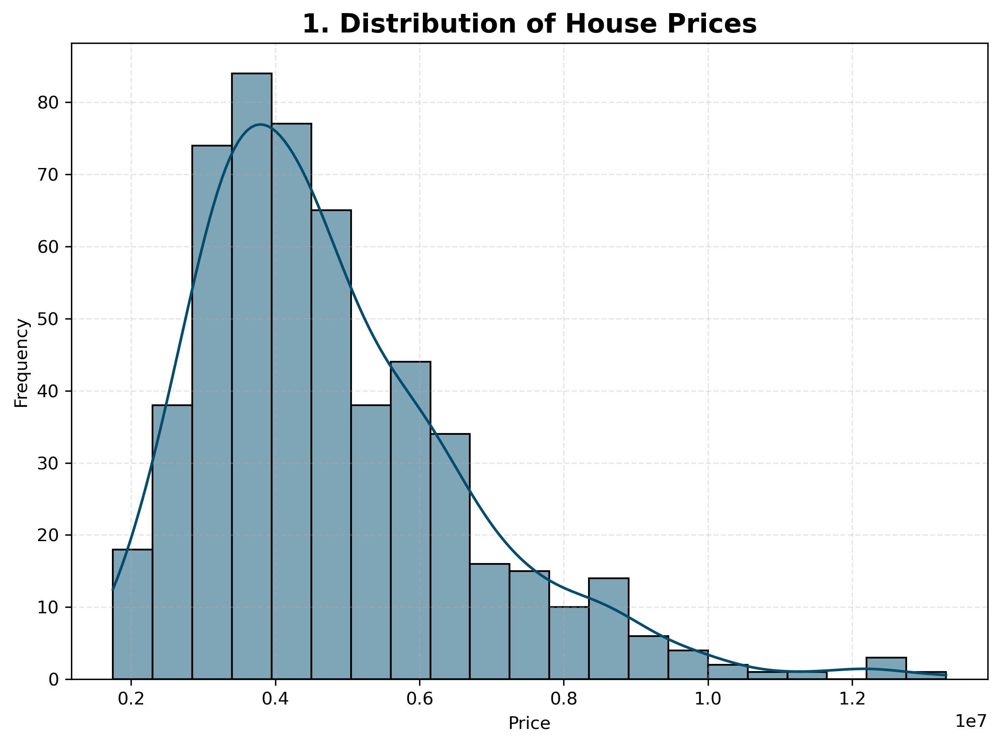
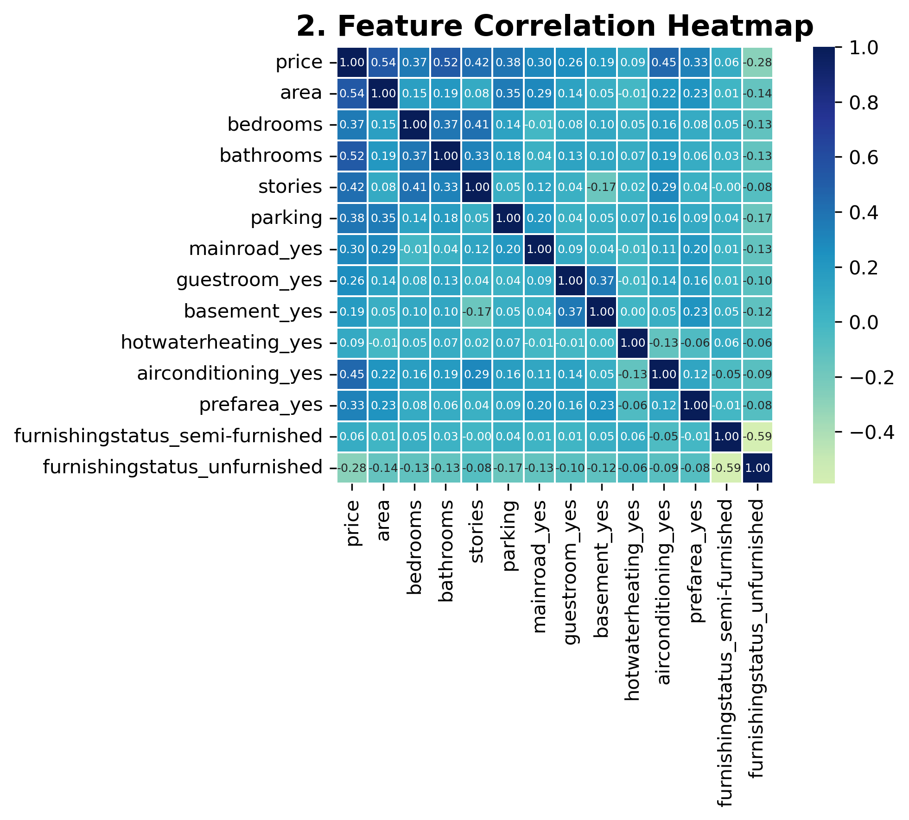
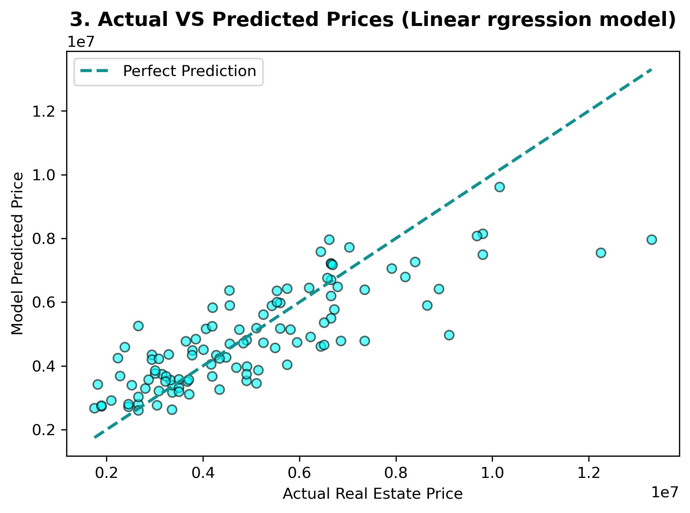

<p align="center">
  
  
  
  
</p>

## 🎯 Project Status

| Component           | Progress        |
| ------------------- | --------------- |
| Data Cleaning       | 🟩🟩🟩🟩🟩 100% |
| EDA                 | 🟩🟩🟩🟩🟩 100% |
| Feature Engineering | 🟩🟩🟩🟩🟩 100% |
| Visualization       | 🟩🟩🟩🟩🟩 100% |
| Model Training      | 🟩🟩🟩🟩🟩 100% |
| Documentation       | 🟩🟩🟩🟩⬜ 90%   |

---

## 🚀 Quick Project Stats

| Metric             | Value             |
| ------------------ | ----------------- |
| 📄 Dataset Records | 545               |
| 📊 Features Used   | 12                |
| 🤖 Model           | Linear Regression |
| 🐍 Language        | Python            |
| 📓 Environment     | Jupyter Notebook  |

---

## 🎨 Feature Showcase

| Feature              | Description                        |
| -------------------  | ---------------------------------- |
| 📊 Data Analysis    | Comprehensive EDA and insights     |
| 🧹 Data Cleaning    | Missing value & duplicate checking |
| 📈 Visualization    | Histogram, Heatmap, Scatter Plot   |
| 🤖 Machine Learning | Linear Regression Model            |
| 📋 Reporting        | Summary PDF Included               |

---

## 🔄 Machine Learning Pipeline

```text
🏠 Housing Dataset
        │
        ▼
🧹 Data Cleaning
        │
        ▼
🔄 Feature Encoding
        │
        ▼
📊 Exploratory Data Analysis
        │
        ▼
📈 Correlation Analysis
        │
        ▼
✂️ Train-Test Split
        │
        ▼
🤖 Linear Regression
        │
        ▼
📉 Prediction
        │
        ▼
📋 Evaluation
```

---

## 📷 Visualization Gallery

### 📊 House Price Distribution



### 🔥 Correlation Heatmap



### 🎯 Actual vs Predicted Prices



---

## 💡 What I Learned

* ✔ Data Cleaning Techniques
* ✔ Feature Encoding
* ✔ Correlation Analysis
* ✔ Data Visualization
* ✔ Linear Regression
* ✔ Model Evaluation
* ✔ Real-world Data Science Workflow

---

## 🏆 Project Outcomes

> 📈 Successfully analyzed housing data.

> 🎯 Built a predictive machine learning model.

> 📊 Created meaningful visualizations.

> 🚀 Gained practical experience in the complete Data Science pipeline.

---

## 📚 Future Improvements

* 🔹 Random Forest Regressor
* 🔹 XGBoost Regressor
* 🔹 Hyperparameter Tuning
* 🔹 Feature Selection Techniques
* 🔹 Model Deployment using Streamlit

---

## 🌟 Repository Support

If you found this project useful:

⭐ Star this repository

🍴 Fork this repository

📢 Share with your friends

💬 Give feedback and suggestions
